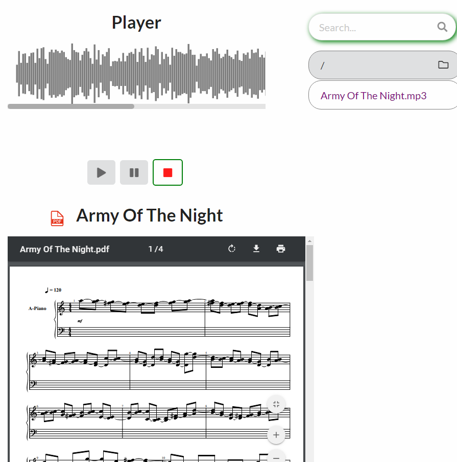

# MAMAM-IA
projet - creation musicale post-mortem

# Le Dataset Utilisé
Vous pouvez retrouver un Dataset qui a été utilisé à cette adresse:
https://www.dropbox.com/s/dhbb0dzdshe22la/song%20classify.rar?dl=0

# Test Interface Web Locale (Windows)

Requis : node.js

Installer twig : npm install twig --save

Aller à la racine du projet web MAMAM-IA-master\audio-player\ et lancer la commande node app.js

Avoir des fichiers .mid ou/et .mp3 dans MAMAM-IA-master\audio-player\data\songs\

Avoir des partition avec les memes titres que les audios en .pdf dans MAMAM-IA-master\audio-player\data\partition

Tester dans une page web http://localhost:3000

# Audio Player

L'audio Player représente la partie IHM qui sera utilisé comme plateforme de mise a disposition au client du contenu.

# La Partie Create Song 
Create Songquant à lui concerne la partie machine learning, plus particulièrement le moteur d'apprentissage que l'on effectue sur nos musiques au format .mid.
Il est preférable d'utiliser des notebooks pour executer LSTM.PY et la partie PREDICT.PY.
Exemple :https://colab.research.google.com/drive/1BHnVYw4ABsKy2lH34PEDRs6TFj4jW1fM

